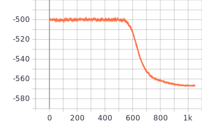

Implementation of <b>Similarity of classification tasks</b> accepted at Neurips Meta-learning Workshop 2020.

# Datasets
Two common data sets are used in the experiments: Omniglot and mini-ImageNet. They are setup identically to the configuration for few-shot learning.

## Omniglot
The structure of the Omniglot dataset follows the conventional few-shot learning, where each class is a character. In addition, all images are scaled down to 28-by-28 pixel2. Note that no data augmentation, such as image rotation, is applied in our implementation.

## mini-ImageNet
For mini-ImageNet, the extracted features are used to infer the parameters of the continuous Latent Dirichlet Co-clustering. Those features are from the paper <i>Meta-learning with latent embedding optimization</i>. For convenience, those features can be downloaded [here](https://www.dropbox.com/sh/dj8gz4a29igxicj/AADsHFA5W_f0wBNnwzOJG5awa?dl=0).

# Running
The main python script is ``gldcc_mle.py``. It is designed with ``argparse``, so that all the setup to run can be efficiently included in the terminal commands. Please see the top two comment lines in the script as examples. You can change some parameters of your interest, but be careful when increasing the number of image-themes ``K``, since it would result in higher demand of memory. In addition, the implementation is also integrated with <b>Tensorboard</b> to easily monitor the training process.

Note that the implementation code follows the pseudo-code specified in the paper.

Also, some patience is needed when inferring parameters (now often called learning) of the continuous Latent Dirichlet Co-clustering. For example, the following figure show the training for Omniglot. Each step size corresponds to 20 episodes. Hence, it might require up to 200k episodes to be converged.

Figure: Variational-free energy (or the negative ELBO) of the continuous Latent Dirichlet Co-clustering on Omniglot dataset.